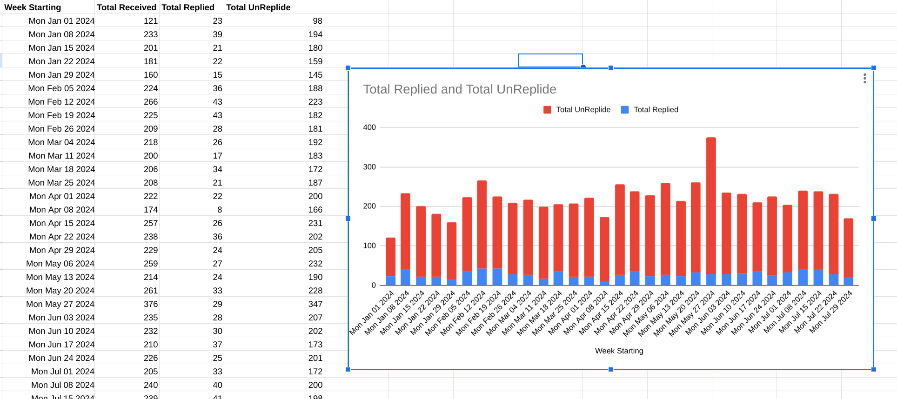

# Gmail Autitor
## AppScript to audit how many emails you receive and reply to 

### [See the subscription manger built into gmail](https://mail.google.com/mail/u/0/#sub)

### What it does:

This Google Apps Script counts your emails week by week, counting how many you received and how many you actually replied to. Then it displays this data in a spreadsheet.

### How to use it:

Copy and paste [this code](code.gs) into your Google Apps Script editor.
Set the startDate: Change the startDate in the run() function to the date you want to start your audit from.
Run it!

